# JVM知识点总结

## 一、概述

​		JVM是Java语言基础中的基础，搞清楚JVM对理解整个java生态至关重要。本章主要从以下几个方面介绍JVM的知识脉络：

* Java字节码
* 类加载器
* java内存模型
* 垃圾回收机制
* JVM调优


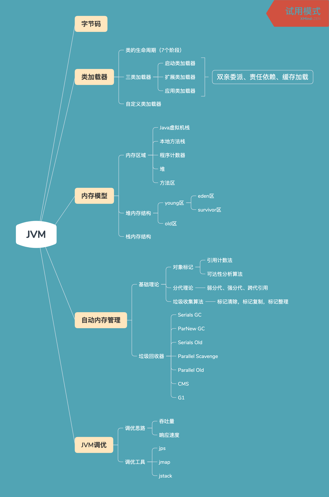


## 二、Java字节码

​	  这部分知识主要设计Java机器码的相关和Java类加载机制的应用。Java机器码的相关有个大概的了解即可，感觉在工作中不做底层这部分知识相对而言应用的比较少，如果用到了，回过头来深入，掌握。

    大致的内容如下

- 四种指令类型：
- 基于栈的计算机器
- 方法调用的指用

Java程序的执行过程：

1. 编写Java文件 -> 2.通过javac命令将Java文件编译称class字节码文件->  3. 通过java命令执行class文件

其中第一步是就是我们平时的主要工作——编写java程序。

2. java编译器执行编译，将java文件编译成class文件，这里就是复杂的编译原理那一套，我们不深入讨论。至于为什么要先编译成字节码，而不是直接在运行状态执行java文件，那是因为跨平台的需要，这也是java语言存在的初衷——一次编译，到处执行。

3. jvm加载执行字节码文件。


## 三、类加载器

​		类加载器（class loader）用来加载 Java 类到 Java 虚拟机中。一般来说，Java 虚拟机使用 Java 类的方式如下：Java 源程序（.java 文件）在经过 Java 编译器编译之后就被转换成 Java 字节代码（.class 文件）。类加载器负责读取 Java 字节代码，并转换成 `java.lang.Class` 类的一个实例。每个这样的实例用来表示一个 Java 类。通过此实例的 `newInstance()` 方法就可以创建出该类的一个对象。实际的情况可能更加复杂，比如 Java 字节代码可能是通过工具动态生成的，也可能是通过网络下载的。

​		类加载中需要掌握的内容有：双亲委派机制和自定义类加载器。类加载机制这个在工作中应用还是比较多了，可能写的比较少，但明里暗里打交道却不少，下面是类加载器相关知识点：

* 类加载器使用的场景或案例
* 三种类加载器：启动类加载器、扩展类加载器、应用类加载器

- 类的7个生命周期（步骤）：加载、链接（效验、准备、解析）、初始化、使用、卸载
- 类的8个加载时机：main、new、遭到调用静态方法的类、遭到访问静态字段的类、子类触发父类、default、反射、MethodHandle
- 不会触发类初始化：6种
- 加载器特点：双亲委托、负责依赖、缓存加载
- 自定义Classloader

### 类加载器的使用场景

1. 隔离

   比如Tomcat容器，每个WebApp有自己的ClassLoader,加载每个WebApp的ClassPath路径上的类，一旦遇到Tomcat自带的Jar包就委托给CommonClassLoader加载。

   

2. 加密

   对于公司的一些核心类库，可能会把字节码加密，这样加载类的时候就必须对字节码进行解密，可以通过findClass读取URL中的字节码，然后加密，最后把字节数组交给defineClass()加载。

### 三种类加载器

#### 双亲委派机制

    这个也是要重点掌握的，了解各个类加载器的关系，特别是父类加载器持有的类是能被子类看见的这一特性。

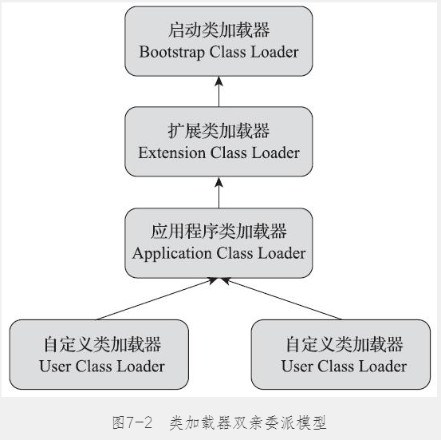

​	    类加载器在尝试自己去查找某个类的字节代码并定义它时，会先代理给其父类加载器，由父类加载器先去尝试加载这个类，依次类推。在介绍代理模式背后的动机之前，首先需要说明一下 Java 虚拟机是如何判定两个 Java 类是相同的。Java 虚拟机不仅要看类的全名是否相同，还要看加载此类的类加载器是否一样。只有两者都相同的情况，才认为两个类是相同的。即便是同样的字节代码，被不同的类加载器加载之后所得到的类，也是不同的。比如一个 Java 类 `com.example.Sample` ，编译之后生成了字节代码文件 `Sample.class` 。两个不同的类加载器 `ClassLoaderA` 和 `ClassLoaderB` 分别读取了这个 `Sample.class` 文件，并定义出两个 `java.lang.Class` 类的实例来表示这个类。这两个实例是不相同的。对于 Java 虚拟机来说，它们是不同的类。试图对这两个类的对象进行相互赋值，会抛出运行时异常 `ClassCastException` 。

#### 类加载过程

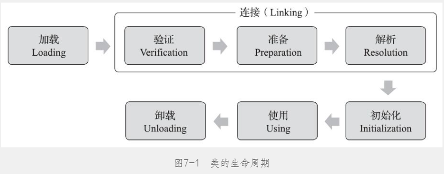

1. 加载（Loading）：找 Class 文件

2. 验证（Verification）：验证格式、依赖

3. 准备（Preparation）：静态字段、方法表

4. 解析（Resolution）：符号解析为引用

5. 初始化（Initialization）：构造器、静态变量赋值、静态代码块

6. 使用（Using）

7. 卸载（Unloading）

了解如上图所示的生命周期，其中有两个点需要注意：

- 准备阶段：会触发静态字典的初始化，包含static变量和代码块，这个时候变量只是赋予系统初始值
- 初始化阶段：构造函数运行和变量初始化

一个实例如下：

```java
// 代码
public class InitExample {
    public static int var = 1;
    static {
         var = 2;
         System.out.println("static print");
    }

    InitExample() {
        System.out.println("init print");
    }

    public static void main(String[] args) {
        InitExample example = new InitExample();
        System.out.println(InitExample.var);
    }
}

// 输出结果
static print
init print
2
```

    从中可以看到，静态先于构造函数，而静态代码块执行先于静态变量语句。


## 四、内存模型

#### JVM内存区域

Java虚拟机在执行Java程序过程中会把它所管理的内存区域划分为若干个不同的数据区域。JVM通过类加载器，将类加载到JVM，由JVM来进行管理调度。

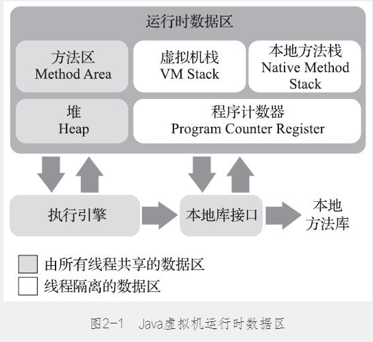


1. 程序计数器

   线程私有，当前线程所执行的字节码的行号指示器，记录当前要执行的虚拟机字节码指令的地址。

2. Java虚拟机栈

   线程私有，生命周期同线程相同。虚拟机栈描述的是Java方法执行的内存模型。每个方法在执行的同时会创建一个栈帧，程序从一个方法入口，不断的调用其他方法，就像叠罗汉一样，一层层的放上叠，每个方法都有其参数、局部变量和返回值，在下层的方法可能会用到上一层的返回值，那么我们要找到上一层方法的入口和返回值，这些信息都包含在栈帧中。当栈帧数超过设置的数量是会抛出StackOverflowError。

3. 本地方法栈

   本地方法栈跟Java虚拟栈类似，区别在于本地方法栈保存的是native方法的栈帧信息，java虚拟机栈保存的是java方法的栈帧信息。

4. Java堆

   这里是线程共有的区域，用于存储对象实例，数组等。垃圾回收器主要作用的区域。

5. 方法区

   也是线程共有的区域，用于存放虚拟机加载的类信息，常量，静态变量，即时编译器编译后的代码等数据。

   - 运行时常量池

 还有非运行时的数据区：直接内存。这部分也会被频繁使用

    上面这些哪些会有OOM现象：Java虚拟机栈（变量不断存放）、本地方法栈（不断递归）、堆（对象不断存放）、方法区（类信息等不断存放）、直接内存

#### 内存模型

理解java内存模型（JMM），是理解java并发的关键。

**JMM决定一个线程对共享变量的写入何时对另一个线程可见**。从抽象的角度来看，JMM定义了线程和主内存之间的抽象关系：**线程之间的共享变量存储在主内存（main memory）中，每个线程都有一个私有的本地内存（local memory），本地内存中存储了该线程以读/写共享变量的副本**。本地内存是JMM的一个抽象概念，并不真实存在。它涵盖了缓存，写缓冲区，寄存器以及其他的硬件和编译器优化。


每个线程都只能访问自己的线程栈。

每个线程都不能访问（看不见）其他线程的局部变量。所有原生类型的局部变量都存储在线程栈中，因此对其他线程是不可见的。线程可以将一个原生变量值的副本传给另一个线程，但不能共享原生局部变量本身。堆内存中包含了 Java 代码中创建的所有对象，不管是哪个线程创建的。 其中也涵盖了包装类型（例如 Byte，Integer，Long 等）。不管是创建一个对象并将其赋值给局部变量， 还是赋值给另一个对象的成员变量， 创建的对象都会被保存到堆内存中。

## 五、垃圾回收机制

### 对象引用的判断

首先思考一个问题，**内存堆中那么多对象，回收器要回收哪些对象？怎么判断出这些要回收的对象呢？**因此对于垃圾回收，判断并标识对象是否可回收是第一步。从理论层面来说，判断对象是否可回收一般两种方法。

**第一种、引用计数器算法：**每当对象被引用一次计数器加1，对象失去引用计数器减1，计数器为0是就可以判断对象死亡了。这种算法简单高效，但是对于循环引用或其他复杂情况，需要更多额外的开销，因此Java几乎不使用该算法。

**第二种、根搜索算法-可达性分析算法：**所谓可达性分析是指**，**顺着GCRoots根一直向下搜索（用一个成语概括就是“顺藤摸瓜”），整个搜索的过程就构成了一条“引用链”，只要在引用链上的对象叫做可达，在引用链之外的（说明跟GCRoots没有任何关系）叫不可达，不可达的对象就可以判断为可回收的对象。

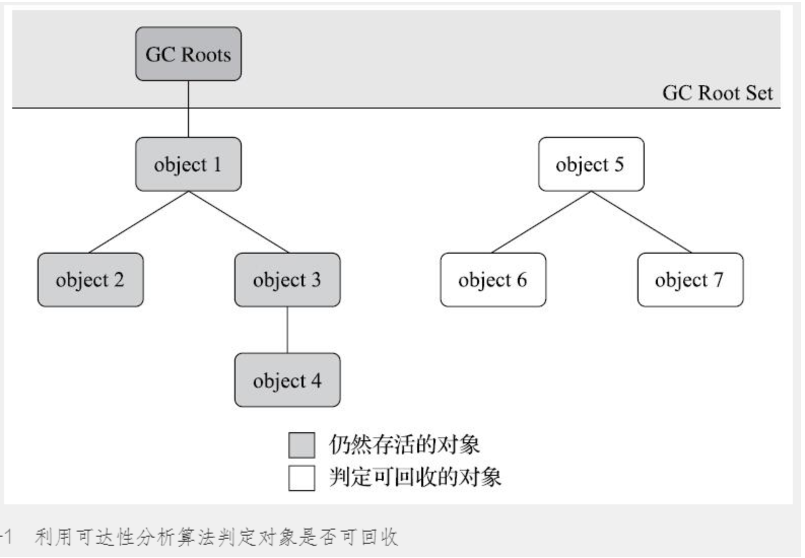

 哪些对象可作为GCRoots对象呢？ 包括如下：

-  在虚拟机栈（栈帧中的本地变量表）中引用的对象，譬如各个线程被调用的方法堆栈中使用到的参数、局部变量、临时变量等。
-  在方法区中类静态属性引用的对象，譬如Java类的引用类型静态变量。
-  在方法区中常量引用的对象，譬如字符串常量池（String Table）里的引用。
-  在本地方法栈中JNI（即通常所说的Native方法）引用的对象。
-  Java虚拟机内部的引用，如基本数据类型对应的Class对象，一些常驻的异常对象（比如NullPointExcepiton、OutOfMemoryError）等，还有系统类加载器。
-  所有被同步锁（synchronized关键字）持有的对象。
-  反映Java虚拟机内部情况的JMXBean、JVMTI中注册的回调、本地代码缓存等。

*如果对虚拟机的内存布局与运行流程有所了解的话，这些作为GCRoots都很好理解，它们是程序运行时的源头，程序的正常运行必须依赖它们，而与这些源头没有任何关系的对象，即可视为可回收对象。* 

### 分代收集理论

    重要的分代假设里面，在ZGC之前，GC算法都有围绕这个假设进行算法设计

- 1）弱分代假说（Weak Generational Hypothesis）：绝大多数对象都是朝生夕灭的。
- 2）强分代假说（Strong Generational Hypothesis）：熬过越多次垃圾收集过程的对象就越难以消亡。
- 3）跨代引用假说（Intergenerational Reference Hypothesis）：跨代引用相对于同代引用来说仅占极少数

### 垃圾收集算法

#### 标记-清除算法

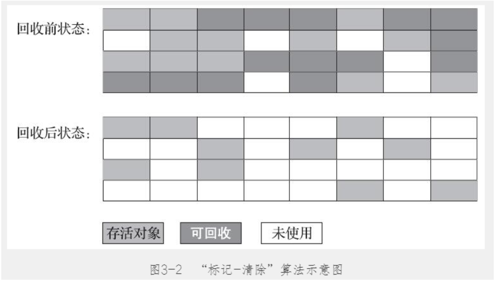

    如它的名字一样，分为标记和清除两个阶段：首先标记出需要清除的对象，标记完成后进行清除

#### 标记-复制算法

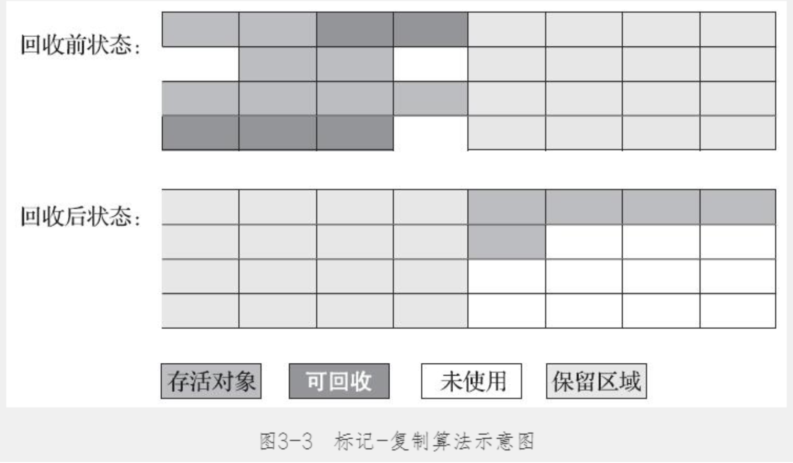

​		它将可用内存按容量划分为大小相等的两块，每次只使用其中的一块。当这一块的内存用完了，就将还存活着的对象复制到另外一块上面，然后再把已使用过的内存空间一次清理掉。如果内存中多数对象都是存活的，这种算法将会产生大量的内存间复制的开销，但对于多数对象都是可回收的情况，算法需要复制的就是占少数的存活对象，而且每次都是针对整个半区进行内存回收，分配内存时也就不用考虑有空间碎片的复杂情况，只要移动堆顶指针，按顺序分配即可。

#### 标记-整理算法

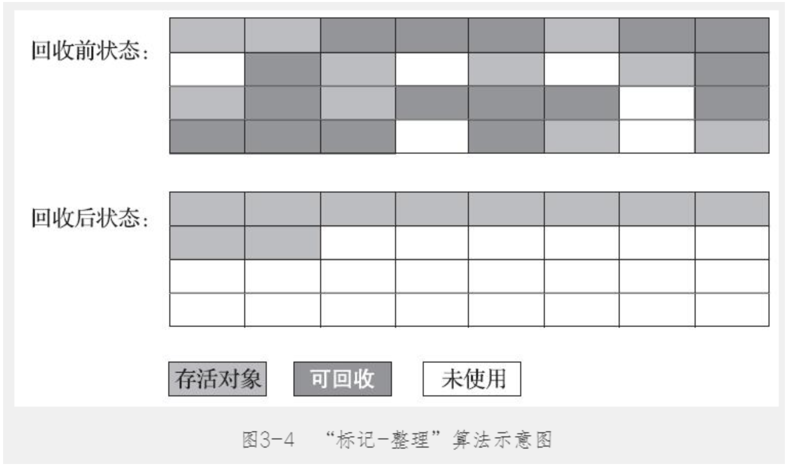

标记-复制算法在对象存活率较高时就要进行较多的复制操作，效率将会降低。更关键的是，如果不想浪费50%的空间，就需要有额外的空间进行分配担保，以应对被使用的内存中所有对象都100%存活的极端情况，所以在老年代一般不能直接选用这种算法。

    其中的标记过程仍然与“标记-清除”算法一样，但后续步骤不是直接对可回收对象进行清理，而是让所有存活的对象都向内存空间一端移动，然后直接清理掉边界以外的内存，“标记-整理”算法的示意图如上图所示。

    整理还有灵活调整空间，可以及时整理，也可以当碎片化到一定程度再进行整理。

#### 几种垃圾回收算法的比较

| 算法           名称 | 原理                                                         | 特点                         | 优缺点                             |
| ------------------- | ------------------------------------------------------------ | ---------------------------- | ---------------------------------- |
| 标记-清除           | 标记出需要回收的对象，然后统一回收对象                       | 需要使用空闲表free-lists记录 | 实现简单，但有内存碎片             |
| 标记-复制           | 标记出未被回收的对象，复制到另外一个区域，然后回收之前的区域 | 需要开辟两个相同的内存空间   | 没有内存碎片，浪费内存空间         |
| 标记-整理           | 标记出需要回收的对象，删除需要回收的对象，然后将未被回收的对象整理成连续空间 | 碰撞指针                     | 没有内存碎片，需要挪动对象内存位置 |

### 7种垃圾回收器

​		**如果说收集算法是内存回收的方法论，那么垃圾收集器就是内存回收的具体实现。**

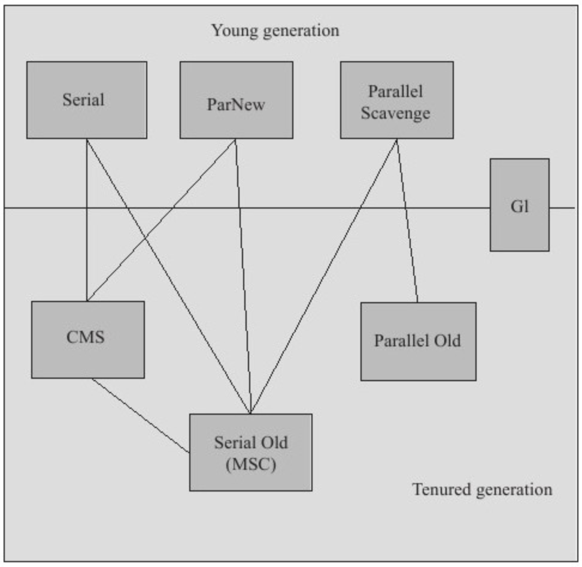

​		上图展示了7种作用于不同分代的收集器，如果两个收集器之间存在连线，就说明它们可以搭配使用。虚拟机所处的区域，则表示它是属于新生代收集器还是老年代收集器。

#### Serial收集器

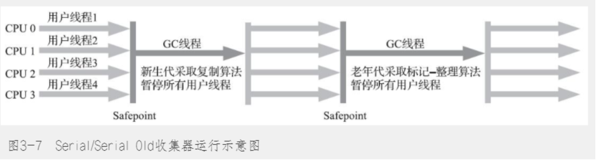

​		Serial收集其是一个单线程的，在其进行垃圾回收时，必须停止业务代码，让其专心进行回收，书中有个形象的比喻：“你妈妈在给你打扫房间的时候，肯定也会让你老老实实地在椅子上或者房间外待着，如果她一边打扫，你一边乱扔纸屑，这房间还能打扫完？”

**其新生代使用标记-复制算法，老年代使用标记-整理算法。**

#### ParNew收集器

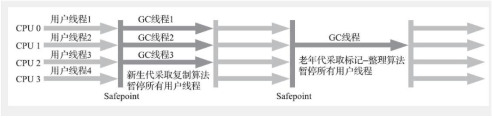

​		如上图所示，ParNew是基于Serial的并行版本，其他的基本没有任何改变，其思想就是利用多线程加快垃圾回收速度

    **其新生代使用标记-复制算法，老年代使用标记-整理算法。**

#### Parallel Scavenge 收集器

​		**Parallel Scavenge**收集器也是一个**并行**的**多线程新生代**收集器，它也使用**复制算法**。Parallel Scavenge收集器的特点是它的关注点与其他收集器不同，CMS等收集器的关注点是尽可能缩短垃圾收集时用户线程的停顿时间，而Parallel Scavenge收集器的目标是**达到一个可控制的吞吐量（Throughput）**。所谓吞吐量就是处理器用于运行用户代码的时间与处理器总消耗时间的比值。

    这个收集器设计目标是达到设定吞吐量，还能智能调节


#### Serial Old收集器


    Serial Old是Serial收集器的老年代版本，它同样是一个单线程收集器，使用标记-整理算法。这个收集器的主要意义也是供客户端模式下的HotSpot虚拟机使用。如果在服务端模式下，它也可能有两种用途：一种是在JDK 5以及之前的版本中与Parallel Scavenge收集器搭配使用，另外一种就是作为CMS收集器发生失败时的后备预案，在并发收集发生Concurrent Mode Failure时使用。

#### Parallel Old收集器


    直到Parallel Old收集器出现后，“吞吐量优先”收集器终于有了比较名副其实的搭配组合，在注重吞吐量或者处理器资源较为稀缺的场合，都可以优先考虑Parallel Scavenge加Parallel Old收集器这个组合。

​		Parallel Old收集器是Parallel Scavenge收集器的老年代版本，使用**多线程**和**“标记-整理”**算法。

#### CMS收集器


    **CMS（Concurrent Mark Sweep）**收集器是一种以**获取最短回收停顿时间**为目标的收集器，它非常符合那些集中在互联网站或者B/S系统的服务端上的Java应用，这些应用都非常重视服务的响应速度。从名字上（“Mark Sweep”）就可以看出它是基于**“标记-清除”**算法实现的。

CMS是基于标记-清楚算法的，如上图所示，一共分为四个步骤：

- **初始标记（CMS initial mark）**：标记GC Roots能直接关联到的对象，速度很快；需要STW。
- **并发标记（CMS concurrent mark）**：进行**GC Roots Tracing**，标记GC Roots的直接关联对象开始遍历标记（并发）；不需要STW；
- **重新标记（CMS remark）**：修正阶段2并发标记中因业务运行导致变动的部分；需要STW；
- **并发清除（CMS concurrent sweep）**：清理删除死亡对象，有内存碎片；不需要STW；

**优点**

CMS是一款优秀的收集器，它的主要**优点**在名字上已经体现出来了：**并发收集**、**低停顿**，因此CMS收集器也被称为**并发低停顿收集器（Concurrent Low Pause Collector）**。

**缺点**

- 对资源敏感，核心4或以上还行，一下影响很大，强占资源
- 浮动垃圾垃圾：由于垃圾回收线程和用户线程同时存在，自然会导致用户线程不断产生垃圾的情况，在本次GC无法处理。
- 有空间碎片：因为采用了标记-清除算法


#### G1 GC

在G1之前的其他收集器进行收集的范围都是整个新生代或者老生代，而G1不再是这样。G1在使用时，Java堆的内存布局与其他收集器有很大区别，它**将整个Java堆划分为多个大小相等的独立区域（Region）**，虽然还保留新生代和老年代的概念，但**新生代和老年代不再是物理隔离的了，而都是一部分Region（不需要连续）的集合**。与其他GC收集器相比，G1具备如下特点：

- **并行与并发** G1 能充分利用多CPU、多核环境下的硬件优势，使用多个CPU来缩短“Stop The World”停顿时间，部分其他收集器原本需要停顿Java线程执行的GC动作，G1收集器仍然可以通过并发的方式让Java程序继续执行。
- **分代收集** 与其他收集器一样，分代概念在G1中依然得以保留。虽然G1可以不需要其他收集器配合就能独立管理整个GC堆，但它能够采用不同方式去处理新创建的对象和已存活一段时间、熬过多次GC的旧对象来获取更好的收集效果。
- **空间整合** G1从整体来看是基于**“标记-整理”**算法实现的收集器，从局部（两个Region之间）上来看是基于**“复制”**算法实现的。这意味着G1运行期间不会产生内存空间碎片，收集后能提供规整的可用内存。此特性有利于程序长时间运行，分配大对象时不会因为无法找到连续内存空间而提前触发下一次GC。
- **可预测的停顿** 这是G1相对CMS的一大优势，降低停顿时间是G1和CMS共同的关注点，但G1除了降低停顿外，还能建立可预测的停顿时间模型，能让使用者明确指定在一个长度为M毫秒的时间片段内，消耗在GC上的时间不得超过N毫秒，这几乎已经是实时Java（RTSJ）的垃圾收集器的特征了。


    G1 GC说是里程牌式的成果，其突破点在于对于内存布局的重新设计（Region），可控的最大停顿时间。可以说这些设计和改进，从CMS开始都是针对追求高响应的服务端的。

    G1大致也分为下面四个阶段：

- **初始标记（Initial Marking）**：仅仅只是标记一下GC Roots能直接关联到的对象，并且修改TAMS指针的值，让下一阶段用户线程并发运行时，能正确地在可用的Region中分配新对象。这个阶段需要停顿线程，但耗时很短，而且是借用进行Minor GC的时候同步完成的，所以G1收集器在这个阶段实际并没有额外的停顿。
- **并发标记（Concurrent Marking）**：从GC Root开始对堆中对象进行可达性分析，递归扫描整个堆里的对象图，找出要回收的对象，这阶段耗时较长，但可与用户程序并发执行。当对象图扫描完成以后，还要重新处理SATB记录下的在并发时有引用变动的对象。
- **最终标记（Final Marking）：**对用户线程做另一个短暂的暂停，用于处理并发阶段结束后仍遗留下来的最后那少量的SATB记录。
- **筛选回收（Live Data Counting and Evacuation）**：负责更新Region的统计数据，对各个Region的回收价值和成本进行排序，根据用户所期望的停顿时间来制定回收计划，可以自由选择任意多个Region构成回收集，然后把决定回收的那一部分Region的存活对象复制到空的Region中，再清理掉整个旧Region的全部空间。这里的操作涉及存活对象的移动，是必须暂停用户线程，由多条收集器线程并行完成的。

 **G1的优缺点：**

- 优点：可控的、低延迟的、基本无碎片，6G-8G较为合适
- 缺点：跨代之间的回收产生的卡表，占较多内存，处理较为复杂，6G以下可能CMS好


#### 

#### 总结

|        收集器         | 串行、并行or并发 | 新生代/老年代 |        算法        |     目标     |                 适用场景                  |
| :-------------------: | :--------------: | :-----------: | :----------------: | :----------: | :---------------------------------------: |
|      **Serial**       |       串行       |    新生代     |      复制算法      | 响应速度优先 |          单CPU环境下的Client模式          |
|    **Serial Old**     |       串行       |    老年代     |     标记-整理      | 响应速度优先 |  单CPU环境下的Client模式、CMS的后备预案   |
|      **ParNew**       |       并行       |    新生代     |      复制算法      | 响应速度优先 |    多CPU环境时在Server模式下与CMS配合     |
| **Parallel Scavenge** |       并行       |    新生代     |      复制算法      |  吞吐量优先  |     在后台运算而不需要太多交互的任务      |
|   **Parallel Old**    |       并行       |    老年代     |     标记-整理      |  吞吐量优先  |     在后台运算而不需要太多交互的任务      |
|        **CMS**        |       并发       |    老年代     |     标记-清除      | 响应速度优先 | 集中在互联网站或B/S系统服务端上的Java应用 |
|        **G1**         |       并发       |     both      | 标记-整理+复制算法 | 响应速度优先 |        面向服务端应用，将来替换CMS        |


## 六、JVM调优

需要准备一两个调优的案例来进行说明。

