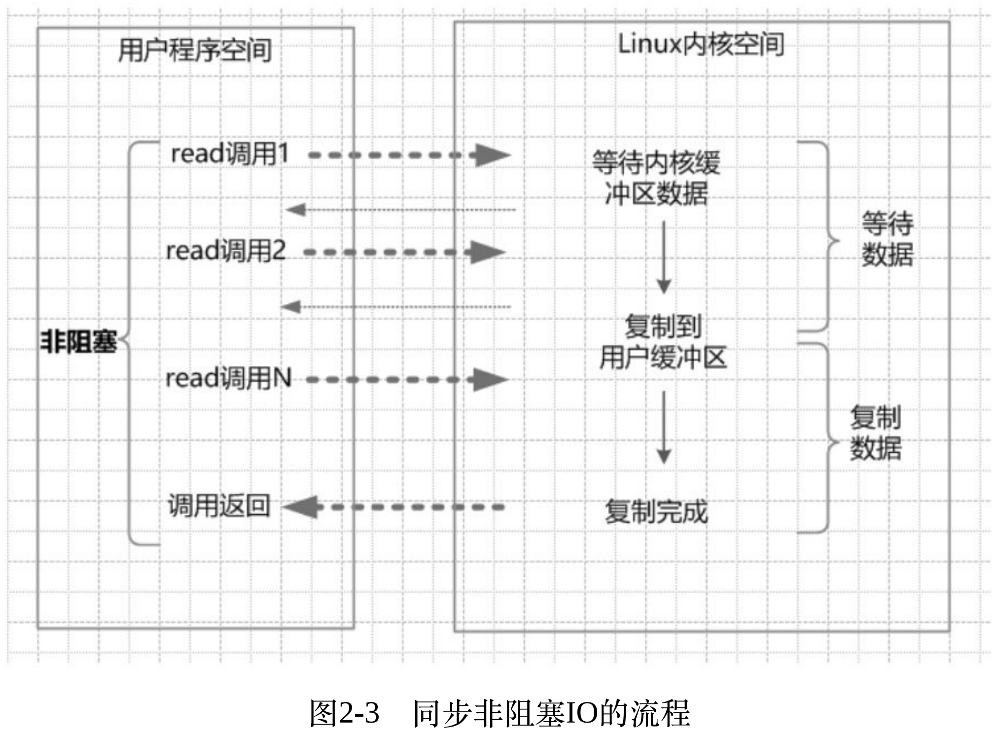

# Java NIO知识点总结

​		学习Java NIO需要先搞清楚IO的底层原理，4种IO模型。


## 一、高并发IO的底层原理

### IO读写的基础原理

IO操作涉及到的两大系统调用read&write，应用层进行IO操作都不是直接与物理设备交互，而是用户缓冲区（用户空间）与内核缓冲区（内核空间）的数据交互。


比如一次Java服务端完成一次socket请求和响应的完整流程如下：

* 客户端请求：Linux通过⽹卡读取客户端的请求数据，将数据读取到内核缓冲区。 

* 获取请求数据：Java服务器通过read系统调⽤，从Linux内核缓冲区读取数据，再送⼊Java进程缓冲区。 

* 服务器端业务处理：Java服务器在⾃⼰的⽤户空间中处理客户端的请求。

* 服务器端返回数据：Java服务器完成处理后，构建好的响应数据，将这些数据从⽤户缓冲区写⼊内核缓冲区。这⾥⽤到的是write系统调⽤。 

* 发送给客户端：Linux内核通过⽹络IO，将内核缓冲区中的数据写⼊⽹卡，⽹卡通过底层的通信协议，会将数据发送给⽬标客户端。

### 四种主要的IO模型

#### 同步阻塞

⾸先，解释⼀下这⾥的阻塞与⾮阻塞： 

阻塞IO，指的是需要内核IO操作彻底完成后，才返回到⽤户空间执⾏ ⽤户的操作。阻塞指的是⽤户空间程序的执⾏状态。传统的IO模型都是同 步阻塞IO。在Java中，默认创建的socket都是阻塞的。 

其次，解释⼀下同步与异步： 

同步IO，是⼀种⽤户空间与内核空间的IO发起⽅式。同步IO是指⽤户 空间的线程是主动发起IO请求的⼀⽅，内核空间是被动接受⽅。异步IO则反过来，是指系统**内核是主动发起IO请求的⼀⽅，⽤户空间的线程是被动接受⽅**。


#### 同步非阻塞

⾮阻塞IO，指的是⽤户空间的程序不需要等待内核IO操作彻底完成， 可以⽴即返回⽤户空间执⾏⽤户的操作，即处于⾮阻塞的状态，与此同时 内核会⽴即返回给⽤户⼀个状态值。

简单来说：阻塞是指⽤户空间（调⽤线程）⼀直在等待，⽽不能⼲别的事情；⾮阻塞是指⽤户空间（调⽤线程）拿到内核返回的状态值就返回⾃⼰的空间，IO操作可以⼲就⼲，不可以⼲，就去⼲别的事情。 


socket连接默认是阻塞模式，在Linux系统下，可以通过设置将socket变成为⾮阻塞的模式（Non-Blocking）。使⽤⾮阻塞模式的IO读写，叫作同步⾮阻塞IO（None Blocking IO），简称为NIO模式。在NIO模型中，应⽤程序⼀旦开始IO系统调⽤，会出现以下两种情况： 

（1）在内核缓冲区中没有数据的情况下，系统调⽤会⽴即返回，返回 ⼀个调⽤失败的信息。 

（2）在内核缓冲区中有数据的情况下，是阻塞的，直到数据从内核缓冲复制到⽤户进程缓冲。复制完成后，系统调⽤返回成功，应⽤进程开始处理⽤户空间的缓存数据。



同步⾮阻塞IO的优点：每次发起的IO系统调⽤，在内核等待数据过程中可以⽴即返回。⽤户线程不会阻塞，实时性较好。 

同步⾮阻塞IO的缺点：**不断地轮询内核，这将占⽤⼤量的CPU时间， 效率低下。** 

总结就是：询问内核是否准备好，内核给一句话（还没），就可以返回用户态了，这是非阻塞的，但等待数据复制的过程是阻塞的。

#### IO多路复用模型

即经典的Reactor反应器设计模式，有时也称为异步阻塞IO，Java中的Selector选择器和Linux中的epoll都是这种模型。 

同步非阻塞的毛病在于，需要用户态不断地询问内核态的状态，效率低下，如果同时有一万个socket连接，那么就会有一万个线程来维护read调用。

如何避免同步⾮阻塞IO模型中轮询等待的问题呢？这就是IO多路复⽤模型。在IO多路复⽤模型中，引⼊了⼀种新的系统调⽤，查询IO的就绪状态。在Linux系统中，对应的系统调⽤为select/epoll系统调⽤。通过该系统调⽤，⼀个进程可以监视多个⽂件描述符，⼀旦某个描述符就绪（⼀般是内核缓冲区可读/可写），内核能够将就绪的状态返回给应⽤程序。随后，应⽤程序根据就绪的状态，进⾏相应的IO系统调⽤。


关键点：

select/epoll系统调用：这个是内核命令，它的作用就是从众多还在准备的连接中，找到可读的连接。所以这个命令底层的实现了，对注册其上的文件描述的监控，一旦调用这个命令，我就把已经准备好的连接返回，select/epoll过程是阻塞的。

这样我们一个应用里面，只需创建一个线程selector，来专门执行select/epoll操作就可以负责成千上万连接的read操作了，这就是IO多路复用模型。其主要核心是利用了select/epoll系统命令。

IO多路复⽤模型的缺点：本质上，select/epoll系统调⽤是阻塞式的，属于同步IO。都需要在读写事件就绪后，由系统调⽤本⾝负责进⾏读写，也就是说这个读写过程是阻塞的。 

Selector轮训调用epoll方法获取可读的连接（阻塞的），对可读的连接进行调用read方法获取数据（阻塞的）。

#### 异步IO模型

异步IO，指的是⽤户空间与内核空间的调⽤⽅式反过来。⽤户空间的线程变成被动接受者，⽽内核空间成了主动调⽤者。这有点类似于Java中⽐较典型的回调模式，⽤户空间的线程向内核空间注册了各种IO事件的回调函数，由内核去主动调⽤。netty就是使用的这种模型。

AIO的基本流程是： ⽤户线程通过系统调⽤，向内核注册某个IO操作。内核在整个IO操作（包 括数据准备、数据复制）完成后，通知⽤户程序，⽤户执⾏后续的业务操 作。在异步IO模型中，在整个内核的数据处理过程中，包括内核将数据从 ⽹络物理设备（⽹卡）读取到内核缓冲区、将内核缓冲区的数据复制到⽤ 户缓冲区，⽤户程序都不需要阻塞。


阻塞IO到异步IO，越往后，阻塞越少，效率也越优。在这四种IO模型中， 前三种属于同步IO，因为真正的IO操作都将阻塞应⽤线程。 只有最后⼀种异步IO模型，才是真正的异步IO模型，可惜⽬前Linux操 作系统尚⽋完善。不过，通过应⽤层优秀框架如Netty，同样能在IO多路复⽤模型的基础上，开发出具备⽀撑⾼并发（如百万级以上的连接）的服务器端应⽤。

### 

### 通过合理配置来支持百万级并发

通过配置文件描述符大小来支撑。文件描述符个数，是指一个应用能够支持的socket连接数。

⽂件句柄，也叫⽂件描述符。在Linux系统中，⽂件可分为：普通⽂ 件、⽬录⽂件、链接⽂件和设备⽂件。⽂件描述符（File Descriptor）是内核为了⾼效管理已被打开的⽂件所创建的索引，它是⼀个⾮负整数（通常是⼩整数），⽤于指代被打开的⽂件。所有的IO系统调⽤，包括socket的 读写调⽤，都是通过⽂件描述符完成的。 

### Select/Poll/Epoll

 可以看到四种IO模型都是在逐步优化的：

传统同步阻塞——用户空间一致阻塞，直到IO结束。

改进1——同步非阻塞模型：先询问内核空间数据是否ready，没有ready立即返回，这个是非阻塞的。同步非阻塞模型也有个问题，就是需要用户态不断的询问内核态是否ready，如果同时有一万个socket连接，那么就会有一万个线程来维护read调用。所以继续改进。

改进2——多路复用模型：同步非阻塞模型的问题在于内核态如果没有就绪的文件描述符，用户态问了也是白问，所以提供一种方式用户态可以直接获取就绪的文件描述符。（select、epoll）。

Select，poll，epoll都是IO多路复用的机制。I/O多路复用就是通过一种机制，一个进程可以监视多个描述符，一旦某个描述符就绪（一般是读就绪或者写就绪），能够通知程序进行相应的读写操作。

select/poll 的几大缺点： 

（1）每次调用 select，都需要把 fd 集合从用户态拷贝到内核态，这个开销在 fd 很多时会很大

（2）同时每次调用 select 都需要在内核遍历传递进来的所有 fd，这个开销在 fd 很多时也很大

（3）**select 支持的文件描述符数量太小了，默认是1024**

select和poll都需要在返回后，`通过遍历文件描述符来获取已经就绪的socket`。事实上，同时连接的大量客户端在一时刻可能只有很少的处于就绪状态，因此随着监视的描述符数量的增长，其效率也会线性下降

epoll（Linux 2.5.44内核中引入,2.6内核正式引入,可被用于代替 POSIX select 和 poll 系统调用）：

（1）**内核与用户空间共享一块内存**

（2）通过回调解决遍历问题

（3）fd 没有限制，可以支撑10万连接

在 select/poll中，进程只有在调用一定的方法后，内核才对所有监视的文件描述符进行扫描，而**epoll事先通过epoll_ctl()来注册一 个文件描述符，一旦基于某个文件描述符就绪时，内核会采用类似callback的回调机制，迅速激活这个文件描述符，当进程调用epoll_wait() 时便得到通知**。(`此处去掉了遍历文件描述符，而是通过监听回调的的机制`。这正是epoll的魅力所在。)

所以select需要在内核态遍历文件描述符，而epoll注册文件描述符的信息，通过回调的方式避免便利。

## 二、Java NIO

### 1. Channel

Channel可类比于BIO中的Socket，这里的Channel要比Socket更加具体，可以把它比作某种具体的交通工具，比如汽车或者高铁，它是具体的通讯载体，是双向性的，一端写入，另外一端读取，反之依然。根据通信形式的不同，其实现有以下几种：

* FileChannel 
* DatagramChannel
* SocketChannel
* ServerSocketChannel


### 2. Buffer

​        Buffer用于和channel通道进行交互，数据是从channel读入缓冲区，从缓冲区写入通道的。**缓冲区本质上是一块可以写入数据，然后可以从中读取数据的内存。**这块内存被包装成NIO Buffer对象，并提供了一组方法，用来方便的访问该块内存。注意Buffer不代表缓冲区，它是操作缓冲区这块内存的对象。可把它类比为列车上的座位，用来承载具体的数据。

Buffer的工作方式

为了理解Buffer的工作原理，需要熟悉它的三个属性：

- capacity   
- position 
- limit

position和limit的含义取决于Buffer处在读模式还是写模式。不管Buffer处在什么模式，capacity的含义总是一样的。

这里有一个关于capacity，position和limit在读写模式中的说明，详细的解释在插图后面。


**capacity**

作为一个内存块，Buffer有一个固定的大小值，也叫“capacity”.你只能往里写capacity个byte、long，char等类型。一旦Buffer满了，需要将其清空（通过读数据或者清除数据）才能继续写数据往里写数据。

**position**

当你写数据到Buffer中时，position表示当前的位置。初始的position值为0.当一个byte、long等数据写到Buffer后， position会向前移动到下一个可插入数据的Buffer单元。position最大可为capacity – 1.

当读取数据时，也是从某个特定位置读。当将Buffer从写模式切换到读模式，position会被重置为0. 当从Buffer的position处读取数据时，position向前移动到下一个可读的位置。

**limit**

在写模式下，Buffer的limit表示你最多能往Buffer里写多少数据。 写模式下，limit等于Buffer的capacity。

当切换Buffer到读模式时， limit表示你最多能读到多少数据。因此，当切换Buffer到读模式时，limit会被设置成写模式下的position值。换句话说，你能读到之前写入的所有数据（limit被设置成已写数据的数量，这个值在写模式下就是position）

### 3. Selector

​        可以把Selector比作一个车站的车辆运行调度系统，它将负责监控每辆车的当前运行状态，是已经出站，还是在路上等。也就是它可以轮训每个Channel的状态。这样的好处是，**一个selector可以同时监控多个channel**，对其进行有效的管理。


监听四种IO事件：

1. 可读：SelectionKey.OP_READ
2. 可写：SelectionKey.OP_WRITE
3. 连接：SelectionKey.OP_CONNECT
4. 接收：SelectionKey.OP_ACCEPT

### 4. 多路复用demo

```java
package nio_demo;

import java.io.IOException;
import java.net.InetSocketAddress;
import java.nio.ByteBuffer;
import java.nio.channels.SelectionKey;
import java.nio.channels.Selector;
import java.nio.channels.ServerSocketChannel;
import java.nio.channels.SocketChannel;
import java.util.Iterator;
import java.util.Set;

/**
 * @author Lijiajun
 * @date 2020/10/30 15:42
 */
public class SelectorSingleThreadServer {
    private ServerSocketChannel server = null;
    private Selector selector = null;

    public void initServer(int port){
        try {
            selector = Selector.open(); //创建一个selector
            server = ServerSocketChannel.open(); //打开一个server通道
            server.configureBlocking(false);
            server.socket().bind(new InetSocketAddress(port));
            server.register(selector, SelectionKey.OP_ACCEPT); // 将server通道注册到selector,状态为OP_ACCEPT，标示可以accept一个connection
        } catch (IOException e) {
            e.printStackTrace();
        }
    }

    public void start() throws IOException {
        System.out.println("Server started。。。");
        while(true) {
            while (selector.select(0) > 0) { //调用select方法寻问内核是否有channel准备好IO操作
                Set<SelectionKey> selectionKeys = selector.selectedKeys(); // 从多路复用器 取出有效的key
                Iterator<SelectionKey> iterator = selectionKeys.iterator();
                while (iterator.hasNext()) { //遍历可操作的channel事件	
                    SelectionKey key = iterator.next();
                    if (key.isAcceptable()) { //如果可以建立连接
                        acceptHandler(key);
                    } else if (key.isReadable()) { //如果可读
                        readHandler(key); //对可读的客户端通道进行数据读取
                    }
                    iterator.remove();
                }
            }
        }
    }

    public void acceptHandler(SelectionKey key) throws IOException {
        ServerSocketChannel ssc = (ServerSocketChannel) key.channel(); //获取服务端channel
        SocketChannel client = ssc.accept(); //获取一个客户端连接
        client.configureBlocking(false);
        client.register(selector, SelectionKey.OP_READ, ByteBuffer.allocate(4)); //注册客户端,channel与buffer绑定
        System.out.println("New client:" + client.getRemoteAddress());
    }

    /***
     * 如何读取缓冲区数据
     * @param key
     * @throws IOException
     */
    public void readHandler(SelectionKey key) throws IOException {
        SocketChannel client = (SocketChannel) key.channel(); //获取客户端channel
        ByteBuffer buffer = (ByteBuffer) key.attachment(); //获取buffer
        //先清空buffer
        buffer.clear();
        while(true) {
            int n = client.read(buffer); //从channel读取数据

            if (n <= 0) { //没有数据或者连接已关闭，推出循环
                break;
            }
            buffer.flip(); //反转buffer，切换成读模式
//            client.write(buffer); 将数据反写回channel
        }


    }
}
```


​	


## 三、Netty

### Netty的特点

#### NIO

基于reactor模型的NIO网络通信框架。

#### 事件驱动

通常，我们设计一个事件处理模型的程序有两种思路*

*  **轮询方式**

线程不断轮询访问相关事件发生源有没有发生事件，有发生事件就调用事件处理逻辑。

* **事件驱动方式**

事件发生时主线程把事件放入事件队列，在另外线程不断循环消费事件列表中的事件，调用事件对应的处理逻辑处理事件。事件驱动方式也被称为消息通知方式，其实是设计模式中观察者模式的思路。

#### 零拷贝

思考服务器将一个文件发送到客户端要经过几次数据拷贝？

1. File.read(bytes)

2. Socket.send(bytes)

这种方式需要四次数据拷贝和四次上下文切换：

1. 数据从磁盘读取到内核的read buffer

2. 数据从内核缓冲区拷贝到用户缓冲区

3. 数据从用户缓冲区拷贝到内核的socket buffer

4. 数据从内核的socket buffer拷贝到网卡接口（硬件）的缓冲区


明显上面的第二步和第三步是没有必要的，通过java的FileChannel.transferTo方法，可以避免上面两次多余的拷贝（当然这需要底层操作系统支持）

1. 调用transferTo,数据从文件由DMA引擎拷贝到内核read buffer

2. 接着DMA从内核read buffer将数据拷贝到网卡接口buffer

上面的两次操作都不需要CPU参与，所以就达到了零拷贝。（零拷贝是指没有cpu参与数据拷贝。）


### Reactor主从模型

Netty主要**基于主从Reactors多线程模型**（如下图）做了一定的修改，其中主从Reactor多线程模型有多个Reactor：MainReactor和SubReactor：

- MainReactor负责客户端的连接请求，并将请求转交给SubReactor
- SubReactor负责相应通道的IO读写请求
- 非IO请求（具体逻辑处理）的任务则会直接写入队列，等待worker threads进行处理


特别说明的是： 虽然Netty的线程模型基于主从Reactor多线程，借用了MainReactor和SubReactor的结构，但是实际实现上，SubReactor和Worker线程在同一个线程池中。

### Netty的运行原理

#### Boss Group

本质是一个acceptor线程池。当服务器监听一个端口的时候，就只有一个线程。这个线程使用selector多路复用的方式监听accept事件，与client建立连接，生成NioSocketChannel，并将NioSocketChannel注册到某个Worker NioEventLoop的Selector上。

#### Worker Group

Worker group是一个负责IO的工作线程池，它是有多个NioEventLoop组成。每个NioEventLoop维护一个selector和taskQueue。NioEventLoop中seletor监听多个channel的read、write事件（当有客户端发送数据过来，将会触发read事件），然后交给业务处理器执行业务逻辑。

#### EventLoop

事件循环器，可以理解为一个持有selector和taskQueue的线程。两个主要功能：

* 监听事件
* 执行事件任务


### Netty组建和设计

可以将Netty的组建分为三大类。

1. 处理和维护通道状态相关的组建——NIO demo中selector和channel相关的关系

   * Channel——Socket

   * EventLoop——控制流、多线程处理、并发
   * ChannelFuture——异步通知

2. 数据流和执行业务逻辑的相关组建——NIO demo中具体事件的处理方法

   * channelHandler

   * ChannelPipeline

3. 引导服务组建——启动Netty服务的引导类，服务器的配置参数，绑定的端口，使用的模型等各种。

   *  ServerBootstrap
   * Bootstrap

#### Channel

通道，Java NIO 中的基础概念,代表一个打开的连接,可执行读取/写入 IO 操作。Netty 对 Channel 的所有 IO 操作都是非阻塞的。

- NioSocketChannel，异步的客户端 TCP Socket 连接
- NioServerSocketChannel，异步的服务器端 TCP Socket 连接
- NioDatagramChannel，异步的 UDP 连接
- NioSctpChannel，异步的客户端 Sctp 连接
- NioSctpServerChannel，异步的 Sctp 服务器端连接 这些通道涵盖了 UDP 和 TCP网络 IO以及文件 IO.

#### ChannelFuture

Java 的 Future 接口，只能查询操作的完成情况, 或者阻塞当前线程等待操作完成。Netty 封装一个 ChannelFuture 接口。我们可以将回调方法传给 ChannelFuture，在操作完成时自动执行。

#### NioEventLoopGroup

NioEventLoopGroup，主要管理eventLoop的生命周期，可以理解为一个线程池，内部维护了一组线程，每个线程(NioEventLoop)负责处理多个Channel上的事件，而一个Channel只对应于一个线程。

#### NioEventLoop

NioEventLoop中维护了一个线程和任务队列，支持异步提交执行任务，线程启动时会调用NioEventLoop的run方法，执行I/O任务和非I/O任务：

- I/O任务 即selectionKey中ready的事件，如accept、connect、read、write等，由processSelectedKeys方法触发。
- 非IO任务 添加到taskQueue中的任务，如register0、bind0等任务，由runAllTasks方法触发。

两种任务的执行时间比由变量ioRatio控制，默认为50，则表示允许非IO任务执行的时间与IO任务的执行时间相等。

#### ChannelHandler

ChannelHandler是一个接口，处理I / O事件或拦截I / O操作，并将其转发到其ChannelPipeline(业务处理链)中的下一个处理程序。

ChannelHandler本身并没有提供很多方法，因为这个接口有许多的方法需要实现，方便使用期间，可以继承它的子类：

- ChannelInboundHandler用于处理入站I / O事件
- ChannelOutboundHandler用于处理出站I / O操作

#### ChannelHandlerContext

保存Channel相关的所有上下文信息，同时关联一个ChannelHandler对象

#### **Encoder &** **Decoder**

处理网络 IO 时，需要进行序列化和反序列化, 转换 Java 对象与字节流。对入站数据进行解码, 基类是 ByteToMessageDecoder。对出站数据进行编码, 基类是 MessageToByteEncoder。 

#### ChannelPipeline

数据处理管道就是事件处理器链。有顺序、同一 Channel 的出站处理器和入站处理器在同一个列表中。

#### Bootstrap、ServerBootstrap

Bootstrap意思是引导，一个Netty应用通常由一个Bootstrap开始，主要作用是配置整个Netty程序，串联各个组件，Netty中Bootstrap类是客户端程序的启动引导类，ServerBootstrap是服务端启动引导类。

### Netty的简单demo

服务端代码

启动引导类

```java
public static void main(String[] args) {
        // 创建mainReactor
        NioEventLoopGroup boosGroup = new NioEventLoopGroup();
        // 创建工作线程组
        NioEventLoopGroup workerGroup = new NioEventLoopGroup();

        final ServerBootstrap serverBootstrap = new ServerBootstrap();
        serverBootstrap 
                 // 组装NioEventLoopGroup 
                .group(boosGroup, workerGroup)
                 // 设置channel类型为NIO类型
                .channel(NioServerSocketChannel.class)
                // 设置连接配置参数
                .option(ChannelOption.SO_BACKLOG, 1024)
                .childOption(ChannelOption.SO_KEEPALIVE, true)
                .childOption(ChannelOption.TCP_NODELAY, true)
                // 配置入站、出站事件handler
                .childHandler(new ChannelInitializer<NioSocketChannel>() {
                    @Override
                    protected void initChannel(NioSocketChannel ch) {
                        // 配置入站、出站事件channel
                        ch.pipeline().addLast(...);
                        ch.pipeline().addLast(...);
                    }
    });

        // 绑定端口
        int port = 8080;
        serverBootstrap.bind(port).addListener(future -> {
            if (future.isSuccess()) {
                System.out.println(new Date() + ": 端口[" + port + "]绑定成功!");
            } else {
                System.err.println("端口[" + port + "]绑定失败!");
            }
        });
}
```

### 尝试性总结

#### 一个客户端请求到服务处理返回到客户端的流程。

1. 启动netty服务器

   ServerBootstrap组装EventLoopGroup，一个Boss group和一个Work group。

2. 客户端通过三次握手与服务端建立连接。

3. netty服务器的boss线程selector监听到了accetp事件，获取一个client连接，生成一个NioSocketChannel，并注册到work group的某个NioEventLoop中的selector上。

4. work线程监听NioSocketChannel的read事件，并将业务逻辑交给入站IO逻辑ChannelInboundHandler处理，ChannelInboundHandler按照ChannelPipeline添加的顺序反向执行。

5. ChannelInboundHandler读取NioSocketChannel的bytebuf，同时可以向NioSocketChannel通道，经过序列化处理向ByteBuf写入二进制数据。

6. 该work线程监听NioSocketChannel的write事件，并将业务逻辑交给出站IO逻辑ChannelOutboundHandler处理，ChannelInboundHandler按照ChannelPipeline添加的顺序反向执行。

### 


## 作业

基础代码可以 fork：[ https://github.com/kimmking/JavaCourseCodes](https://github.com/kimmking/JavaCourseCodes)
02nio/nio02 文件夹下
实现以后，代码提交到 Github。

**1.（必做）**整合你上次作业的 httpclient/okhttp；

**2.（选做）**使用 netty 实现后端 http 访问（代替上一步骤）

**3.（必做）**实现过滤器。
**4.（选做）**实现路由。


**1. 整合HttpClient**

思路：将InboundHandler中装配的handler，替换成自己实现的HttpClient。


```java
private HttpClientSender handler;

public HttpInboundHandler(String proxyServer) {
    this.proxyServer = proxyServer;
    handler = new HttpClientSender(this.proxyServer);
}
```


**2. 使用netty实现后端http访问**

思路：客服端请求   **→**     netty网关入站处理（发送到netty客户端）&rarr;  netty客户端入站处理（请求后端）&rarr;   后端处理返回 &rarr;  netty客户端出站处理（往网关通道写入后端数据）&rarr;   netty网关出站处理（往客户端通道写入netty客户端数据）&rarr;  客户端输出响应值

如果不对response响应的数据进行数据修改，那么可以不用单独实现OutboundHandler，直接将InboundHandler对于后端返回的数据写入通道，但这里需要注意编码问题。

这里使用装配模式，通过参数选择对应的Client，通过handle方法统一与后端服务进行通信。


**3. 实现过滤器**

在请求流入InboundHandler的channelRead方法时，执行filter方法，添加一个FullHttpRequest的header。

```java
public class CustomFilter implements HttpRequestFilter {
    @Override
    public void filter(FullHttpRequest fullRequest, ChannelHandlerContext ctx) {
        if (fullRequest != null) {
            fullRequest.headers().set("nio", "lijiajun");
        }
    }
}
```


```java
@Override
public void channelRead(ChannelHandlerContext ctx, Object msg) {
    FullHttpResponse response = null;
    FullHttpRequest fullRequest = (FullHttpRequest) msg;

    try {
        //过滤器
        CustomFilter customFilter = new CustomFilter();
        customFilter.filter(fullRequest, ctx);


        //调用任意装配的clientHandler 发送请求，netty阻塞结果
        String value = handler.handle(fullRequest, ctx);
```


**4. 实现路由**

这里的思路是将一组proxyServerList传给具体调用的Client，案列中实现了HttpClient和Netty，然后采用随机算法随机选用一台后端服务进行发送或连接。

```java
private String randomProxyServer() {
    Random random = new Random();
    int index = random.nextInt(proxyServerList.size());
    return proxyServerList.get(index);
}
```


**5. 性能压测**

分别对HttpClient和Netty模式下进行压力测试

wrk -c40 -d60S http://localhost:8888/api/hello


HttpClient(同步实现)：19161.59

Netty：1634.63 

测出来Netty性能较低，目测代码有问题。。。（继续改造。。。）

-------

引用：

1. http://ifeve.com/buffers/

2. https://www.tutorialspoint.com/java_nio/java_nio_quick_guide.htm

3. 《深入分析Java Web 技术内幕（修订版）》

4. 《Java NIO》

5. 《Netty 实战》
6. https://blog.csdn.net/weixin_30722589/article/details/96296914
