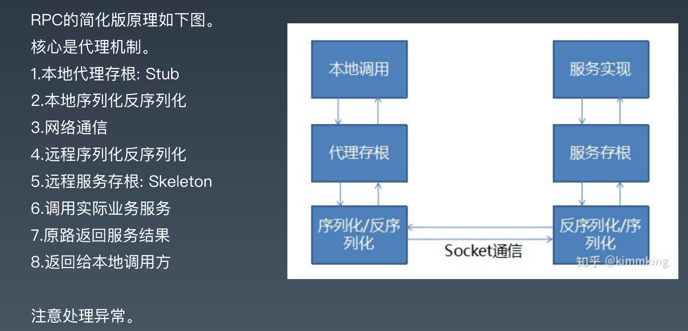
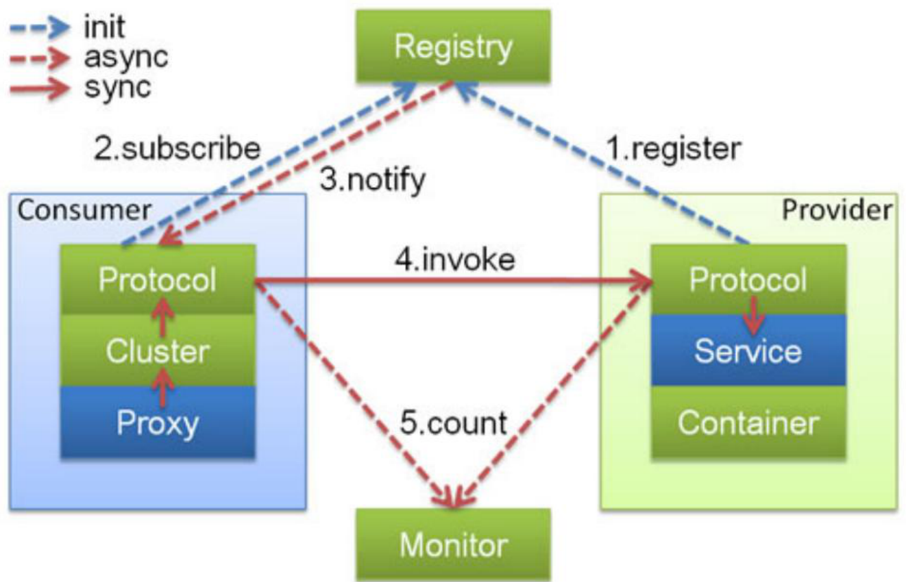
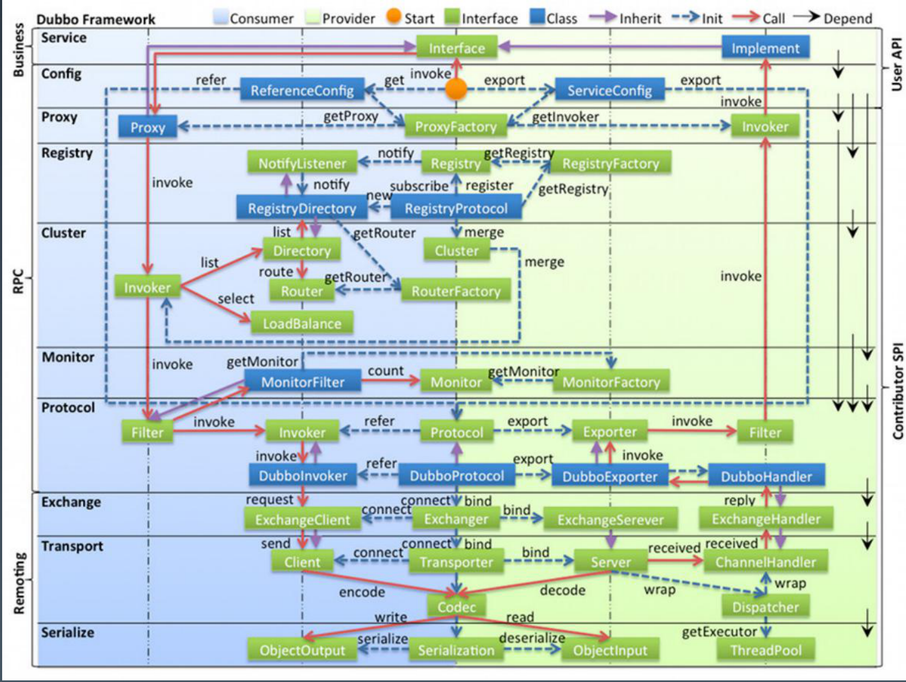
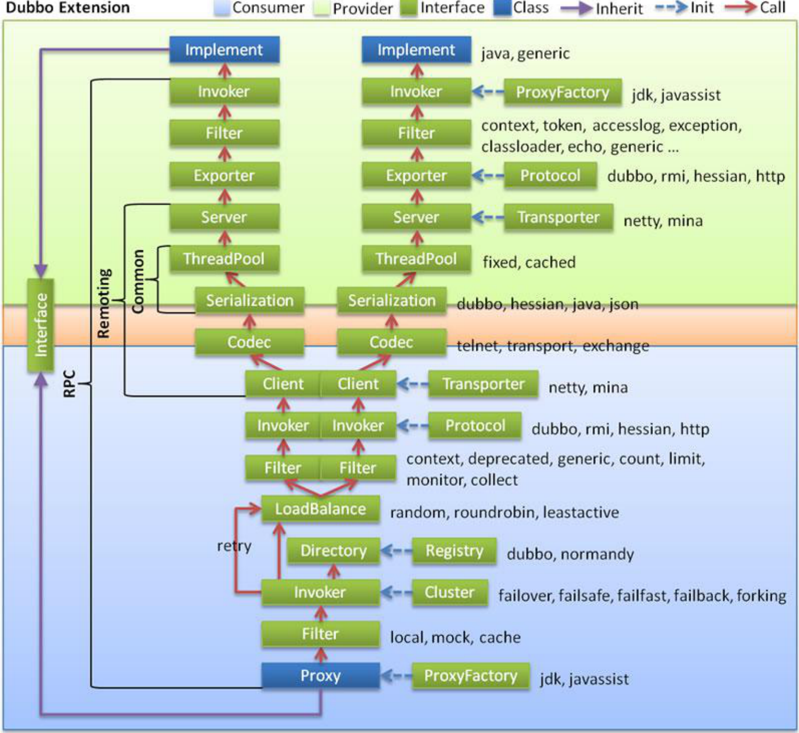
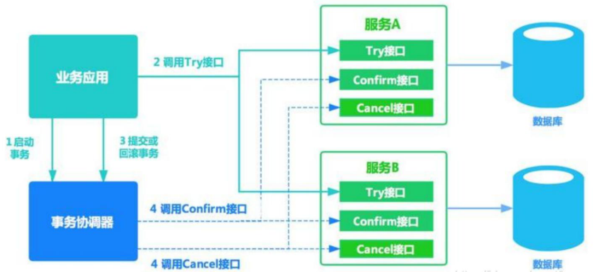

## 1. RPC的概念

RPC远程过程调用，“像调用本地方法一样调用远程方法”。

在微服务中，服务之间的调用属于远程调用，为了方便系统之间的调用，rpc孕育而生。

RPC的原理图



可以看到，Java中的RMI就是一种rpc，核心就是代理机制。

本地通过调用代理类来访问远程方法，远程方法根据方法签名（哪个类，哪个方法，参数如何）来执行相应的方法。

* 所以这里代理类需要实现网络通信，因为他需要访问远端，这里面必要要序列化与反序列化。

* 远端有一个自己的注册表，里面注册了各个实现类，用来执行具体的逻辑。因此远端需要根据传入的参数来找到具体的实现类。


这里面的重要的点：

1. 如何实现本地代理

   实现一个代理类有很多方式：

   * Java动态代理：Proxy.newInstance
   * 字节码增强：ByteBuddy，ASM等

2. 通讯方式

   * Http：OkHttpClient，netty等
   * Tcp: Socket，netty等。

3. 序列化

   * 二进制：
   * Json：Jackson

4. 服务器如何找到实现类

   这个根据业务而定，其核心就是维护一个context的注册表，类似Spring的Bean容器。


如果是分布式环境，会遇到什么问题？

也就是远端服务可能有多个节点，比如本地调用远端的OrderServce（假如有2个节点）。这里面需要解决两个问题。

  1. 本地如何发现远端服务，如何寻址的问题（比如feign中是通过http传入url来找到服务）。

     这里本地发现远端服务，需要满足：远端条件必然可用，而不是不可访问或是访问异常的。那么必定需要一个第三方来管理这些服务，使服务之间可以相互之间可见，同时还能知道各个服务是否健康。那么这个第三方就是我们的Zookeeper，称为服务注册中心。

  2. 如何决定是调用OrderService1还是OrderService2

     这里我的理解可能有两种方式：一种是客户端采取负载均衡策略决定调用哪个OrderService，但这种方式需要客户端维护一个服务列表，类似于Spring Cloud Robbin；第二种交给服务注册中心来决定，服务注册中心根据自己的策略来随机或者轮训选择健康的服务。这样的好处是客户端不需要维护调用列表，但坏处就是使注册中心承担了消息的转发，需要吸收转发过来的网络流量，使其职责不单一。	


通过下一讲的学习知道了：

1. zookeeper的存储结构是基于namespace的文件系统。

2. zookeeper不具备计算能力，因此不会进行如上第二点说的在zookeeper中进行负载均衡策略，zookeeper只负责数据一致性的维护，所有计算操作都是基于client端进行。

3. 回到上面第一个问题，由于client端与zookeeper保持着长连接，client端掉线后，会被zookeeper删除其注册的节点，并通知给其他client，其他client收到通知后可以从新更新zookeeper的service或者更新其本地缓存，达到数据更新的目的，因此client总能访问到健康的服务。第二个问题，基于zookeeper存储原理，我们知道了应该以某个服务service的命名空间作为目录，其子节点为可提供服务的机器地址。结构如下：

   /io.github.jesse0722.zookeeperDemo.service.UserService

   ​	--- 10.1.7.185_8080

   ​    --- 10.1.7.186_8080

   基于这个结构我们可以获取service下的注册机器，通过负载均衡，router策略，filter等机制选出一台进行调用。

使用Curator客户端连接Zookeeper进行相关操作：

Provider将service注册到zookeeper：

```java
		// start zk client
		RetryPolicy retryPolicy = new ExponentialBackoffRetry(1000, 3);
		CuratorFramework client = CuratorFrameworkFactory.builder().connectString("localhost:2181").namespace("rpcfx").retryPolicy(retryPolicy).build();
		client.start();
				// register service
		// xxx "io.kimmking.rpcfx.demo.api.UserService"

		String userService = "io.kimmking.rpcfx.demo.api.UserService";
		registerService(client, userService);
		String orderService = "io.kimmking.rpcfx.demo.api.OrderService";
		registerService(client, orderService);

private static void registerService(CuratorFramework client, String service) throws Exception {
		ServiceProviderDesc userServiceSesc = ServiceProviderDesc.builder()
				.host(InetAddress.getLocalHost().getHostAddress())
				.port(8080).serviceClass(service).build();
		// String userServiceSescJson = JSON.toJSONString(userServiceSesc);

		try {
			if ( null == client.checkExists().forPath("/" + service)) {
				client.create().withMode(CreateMode.PERSISTENT).forPath("/" + service, "service".getBytes());
			}
		} catch (Exception ex) {
			ex.printStackTrace();
		}
		//临时节点
		client.create().withMode(CreateMode.EPHEMERAL).
				forPath( "/" + service + "/" + userServiceSesc.getHost() + "_" + userServiceSesc.getPort(), "provider".getBytes());
	}

```

Consumer从zookeeper获取provider的注册地址列表：

```java
    public static <T, filters> T createFromRegistry(final Class<T> serviceClass, final String zkUrl, Router router, LoadBalancer loadBalance, Filter filter) throws Exception {

        // 加filter之一
        // start zk client
        RetryPolicy retryPolicy = new ExponentialBackoffRetry(1000, 3);
        CuratorFramework newClient = CuratorFrameworkFactory.builder().connectString(zkUrl).namespace("rpcfx").retryPolicy(retryPolicy).build();
        newClient.start();
        //获取需要获取服务下对应的机器节点
        List<String> rpcfx = newClient.getChildren().forPath("/" + serviceClass.getName());
        // curator Provider list from zk
        List<String> invokers = rpcfx;
        // 1. 简单：从zk拿到服务提供的列表
        // 2. 挑战：监听zk的临时节点，根据事件更新这个list（注意，需要做个全局map保持每个服务的提供者List）

        List<String> urls = router.route(invokers);

        String url = loadBalance.select(urls); // router, loadbalance
        String[] s = url.split("_");
        url = "http://" + s[0] + ":" + s[1];
        return (T) create(serviceClass, url, filter);

    }
```


## 2. Dubbo原理

### 2.1 Dubbo设计原理



### 2.2 整体架构



1. config 配置层：对外配置接口，以 ServiceConfig, ReferenceConfig 为中心，可以直接初始化配置类，也可以通过 spring 解析配置生成配置类 。

2. proxy 服务代理层：服务接口透明代理，生成服务的客户端 Stub 和服务器端 Skeleton, 以 ServiceProxy 为中心，扩展接口为 ProxyFactory。

3. registry 注册中心层：封装服务地址的注册与发现，以服务 URL 为中心，扩展接口为 RegistryFactory, Registry, RegistryService。 

4. cluster 路由层：封装多个提供者的路由及负载均衡，并桥接注册中心，以 Invoker 为中心， 扩展接口为 Cluster, Directory, Router, LoadBalance。

5. monitor 监控层：RPC 调用次数和调用时间监控，以 Statistics 为中心，扩展接口为 MonitorFactory, Monitor, MonitorService。

6. protocol 远程调用层：封装 RPC 调用，以 Invocation, Result 为中心，扩展接口为 Protocol, Invoker, Exporter 

7. exchange 信息交换层：封装请求响应模式，同步转异步，以 Request, Response 为中心， 扩展接口为 Exchanger, ExchangeChannel, ExchangeClient, ExchangeServer 

8. transport 网络传输层：抽象 mina 和 netty 为统一接口，以 Message 为中心，扩展接口为 Channel, Transporter, Client, Server, Codec。 

9. serialize 数据序列化层：可复用的一些工具，扩展接口为 Serialization, ObjectInput, ObjectOutput, ThreadPool。




## 3. 作业

### 1. 改造自定义 RPC 的程序，提交到 GitHub：

 1） 尝试将服务端写死查找接口实现类变成泛型和反射；

 2）尝试将客户端动态代理改成字节码增强，添加异常处理；

 3）尝试使用 Netty+HTTP 作为 client 端传输方式。

1. 可以尝试将实现类放在一个特定的文件位置，启动时通过反射加载到内存。

```java
public class RpcServiceRegister {

    public HashMap<String, Class<?>> serviceContext = new HashMap<>();


    /***
     * 获取所有service目录下的实现类
     * @param servicePath
     */
    public RpcServiceRegister(String servicePath) {
        Set<Class<?>> implServiceList = ClassUtil.getClasses(servicePath);

        for (Class clz : implServiceList) {
            Class[] interfaces = clz.getInterfaces();
            for (Class inf: interfaces) {
                if (clz.getSimpleName().startsWith(inf.getSimpleName())) {
                    serviceContext.put(inf.getName(), clz);
                }
            }
        }
    }

    public HashMap<String, Class<?>> getServiceContext() {
        return serviceContext;
    }
}
```

2. 通过ByteBuddy字节码技术动态生成对象。

```java
		public static <T> T create(final Class<T> serviceClass, final String url) throws IllegalAccessException, 							InstantiationException {
        // 0. 替换动态代理 -> 字节码生成;
        return new ByteBuddy()
                .subclass(serviceClass)
                .method(ElementMatchers.any())
                .intercept(MethodDelegation.to(new Interceptor()))
                .make()
                .load(Rpcfx.class.getClassLoader())
                .getLoaded().newInstance();

    }
		//以上通过byteBuddy,扩展serviceClass对其任意的方法进行拦截，并且委托给Interceptor的intercept方法执行，该方法通过传入
		// 的Method对象可知其调用的方法，类名及参数，然后进行post操作。
public class Interceptor {

    public static final MediaType JSONTYPE = MediaType.get("application/json; charset=utf-8");

    @RuntimeType
    public Object intercept(@Origin Method method, @AllArguments Object[] args) throws Throwable {
        RpcfxRequest rpcfxRequest = new RpcfxRequest();
        rpcfxRequest.setMethod(method.getName());
        rpcfxRequest.setServiceClass(method.getDeclaringClass().getName());
        rpcfxRequest.setParams(args);


        String reqJson = JSON.toJSONString(rpcfxRequest);
        System.out.println("req json: "+reqJson);

        // 1.可以复用client
        // 2.尝试使用httpclient或者netty client
        OkHttpClient client = new OkHttpClient();
        final Request request = new Request.Builder()
                .url("http://localhost:8080/")
                .post(RequestBody.create(JSONTYPE, reqJson))
                .build();
        String respJson = client.newCall(request).execute().body().string();
        System.out.println("resp json: "+respJson);
        RpcfxResponse response = JSON.parseObject(respJson, RpcfxResponse.class);
        return JSON.parse(response.getResult().toString());
    }

}
		
```

3. Netty作为客户端发送http请求

这里将Netty作为客户端需要注意的有两点：

* 支持http编码解码
* 由于netty所有的方法都是异步的，所以如何同步发送结果。方法有两种，1种是阻塞异步发放直到返回结果，二是添加listener。

```java
 public RpcfxResponse send(RpcfxRequest rpcfxRequest) throws Exception {
        EventLoopGroup workerGroup = new NioEventLoopGroup();

        try {
            Bootstrap b = new Bootstrap();
            b.group(workerGroup)
                .channel(NioSocketChannel.class)
                .remoteAddress(new InetSocketAddress(host,port))
                .option(ChannelOption.SO_KEEPALIVE, true)
                .handler(new ChannelInitializer<SocketChannel>() {
                @Override
                public void initChannel(SocketChannel ch) throws Exception {
                    // 客户端接收到的是httpResponse响应，所以要使用HttpResponseDecoder进行解码
                    ch.pipeline().addLast(new HttpResponseDecoder());
                    // 客户端发送的是httprequest，所以要使用HttpRequestEncoder进行编码
                    ch.pipeline().addLast(new HttpRequestEncoder());
                    ch.pipeline().addLast(new HttpObjectAggregator(1024*1024));
                    ch.pipeline().addLast(new HttpServerExpectContinueHandler());
                    ch.pipeline().addLast(clientHandler);
                }
            });

            // Start the client.
            ChannelFuture f = b.connect().sync(); //连接服务端，同步阻塞直到连接完成。

            RpcfxResponse response = this.post(rpcfxRequest); //发送请求
            f.channel().closeFuture().sync();

            return response;
        } finally {
            workerGroup.shutdownGracefully();
        }

    }

    private RpcfxResponse post(RpcfxRequest rpcfxRequest) throws InterruptedException {
        byte[] bytes = JSON.toJSONBytes(rpcfxRequest);
        FullHttpRequest request = new DefaultFullHttpRequest(HttpVersion.HTTP_1_0, HttpMethod.POST, "/",
                Unpooled.wrappedBuffer(bytes));
        request.headers().add(HttpHeaderNames.CONNECTION,HttpHeaderValues.KEEP_ALIVE);
        request.headers().add(HttpHeaderNames.CONTENT_TYPE, HttpHeaderValues.APPLICATION_JSON);
        request.headers().add(HttpHeaderNames.CONTENT_LENGTH,request.content().readableBytes());
        //使用业务处理器的ctx刷入请求
        ChannelPromise channelPromise = clientHandler.flushMessage(request); 
        channelPromise.await(); //同步阻塞，直到isSuccess()为true
        return clientHandler.getRpcfxResponse();
    }

public class HttpClientHandler extends ChannelInboundHandlerAdapter {
    private ChannelHandlerContext ctx;
    private ChannelPromise promise;
    private volatile RpcfxResponse rpcfxResponse;

    public ChannelPromise flushMessage(FullHttpRequest request) {
        if (ctx == null)
            throw new IllegalStateException();

        System.out.println("flush flushMessage");
        promise = ctx.writeAndFlush(request).channel().newPromise();
        return promise;
    }

    @Override
    public void channelActive(ChannelHandlerContext ctx) throws Exception {
        super.channelActive(ctx);
        this.ctx = ctx;
        System.out.println("已连接");
    }

    @Override
    public void channelRead(ChannelHandlerContext ctx, Object msg) throws Exception {

        if(msg instanceof FullHttpResponse){
            FullHttpResponse response = (FullHttpResponse)msg;
            ByteBuf buf = response.content();
            String result = buf.toString(CharsetUtil.UTF_8);
            this.rpcfxResponse = JSON.parseObject(result, RpcfxResponse.class);
            this.promise.setSuccess(); //任务完成
        }
    }

    public RpcfxResponse getRpcfxResponse() throws InterruptedException {
        return this.rpcfxResponse;
    }

}
```

4. 利用zookeeper实现一个简单的rpc框架

* 服务端：Spring加载完成后，将特定注解的实现类服务自动注册到zookeeper。
* 客户端：动态代理类利用curator从zookeeper获取注册表信息。
* 客户端：动态维护zk提供的list，监听zk的临时节点，动态更新list。

将特殊注解标示的实现类自动注册到zk。

这里由于实现类已经注册成了bean，只需要在spring加载完成后，在某个时机进行注册就好，分别实现了ApplicationContextAware，SmartInitializingSingleton接口，一个用于获取spring上下文，一个单例加载完后回调。

另外一种情况是实现类本身没有注册成bean，可参考Mybatis的Mapper实现。

服务端实现：

```java
@Component
public class ServiceAutoZkRegister implements ApplicationContextAware, SmartInitializingSingleton {
    
    private CuratorFramework client;

    private ApplicationContext applicationContext;

    @Autowired
    public ServiceAutoZkRegister(CuratorFramework client) {
        this.client = client;
    }

    @Override
    public void setApplicationContext(ApplicationContext applicationContext) throws BeansException {

        this.applicationContext = applicationContext;
    }

    private void registerService(CuratorFramework client, String service) throws Exception {
        ServiceProviderDesc userServiceSesc = ServiceProviderDesc.builder()
                .host(InetAddress.getLocalHost().getHostAddress())
                .port(8080).serviceClass(service).build();

        try {
            if ( null == client.checkExists().forPath("/" + service)) {
                client.create().withMode(CreateMode.PERSISTENT).forPath("/" + service, "service".getBytes());
            }
        } catch (Exception ex) {
            ex.printStackTrace();
        }
        //临时节点
        client.create().withMode(CreateMode.EPHEMERAL).
                forPath( "/" + service + "/" + userServiceSesc.getHost() + "_" + userServiceSesc.getPort(), "provider".getBytes());
    }
  
   @Override
    public void afterSingletonsInstantiated() {
        if(applicationContext != null) {
            Map<String, Object> beansWithAnnotation = applicationContext.getBeansWithAnnotation(RpcImplService.class);
            //通过反射获取bean的父接口名称作为zk的地址，自动注册到zk
            beansWithAnnotation.values().forEach( value -> {
                Class<?>[] interfaces = value.getClass().getInterfaces();
                if (interfaces.length != 1) {
                    throw new RuntimeException("Service Auto Register Error!" + value.getClass().getName() + "can only implement one interface.") ;
                }
                String serviceKey = interfaces[0].getName();
                try {
                    registerService(client, serviceKey);
                } catch (Exception e) {
                    e.printStackTrace();
                }
            });
        }
    }
}
```

客户端实现：

主要考虑从zk获取服务地址后，采取的负载均衡策略、router策略，filter等处理。


### 2. 结合dubbo+hmily，实现一个TCC外汇交易处理。

1）用户A的美元账户和人民币账户都在A库，使用1美元兑换7人民币； 

2）用户B的美元账户和人民币账户都在B库，使用7人民币兑换1美元； 

3）设计账户表，冻结资产表，实现上述两个本地事务的分布式事务。 


#### **TCC原理**




TCC是try-confirm-cancle的缩写，它是分布式事务解决方案。既然是分布式事务解决方案，那必然就是解决多个服务之间数据一致性的问题。比如上述问题，当用户A向用户B转账美元或人民币时，需要扣除用户A的账户余额，同时增加用户B的账户余额。

如果在A库所在系统转账，不考虑分布式事务问题的代码如下（有问题的代码）：

````java
public Boolean transferOut(A,2000) {
    result = clientB.transferIn(B,2000);
    if(result) {
       this.updateAccount(A);
    }
}
````

这里如果result返回true就还好，如果调用服务B的方法异常或者超时就会导致账户A更新余额失败，但账户B又可能更新成功了，导致数据不一致。

解决分布式事务问题有很多方案，大致可以分为：基于XA的强一致性分布式事务，TCC柔性事务，最终一致性方案。

XA：是基于mysql-xa的机制，将多个事务委托给一个全局事务进行控制管理达到多个事务的一致性。比如这里用一个xa事务包裹A库和B库的事务，在A和B都prepare的情况下，进行提交保证一致。

最终一致性方案：当调用发生异常，对于不确定的状态，全部采用重拾+幂等的方式将不确定状态推进到终态，达到最终一致性。但是这个方案主要应用于对数据一致性要求不那么高的场景下，因为重拾一般采用定时任务，在状态没有推动到终态以前，意味着在这种情况下，实际双方的账户金额是对不上的，这种情况在银行系统肯定是不太能接受的，比如A转了2000给B，但由于B异常，导致A需要推进状态，此时B增加了2000元，但A账户没有减少2000，此时如果他有进行转账就会造成透支账户等情况。

TCC：是一种柔性事务解决方案。XA的问题在于高并发下，对性能负担严重。最终一致性的方案的问题在于，数据可能不一致且可能导致透支的情况。TCC通过事务管理器负责总体的事务调度，对于事务管理器，有如下逻辑：

```java
//业务全局事务注册
try {
   clientA.transfer(); //tranfer()方法需要注册起confirm、cancle方法名，以便后面调用。
   clientB.transfer();
} catch (e) {
   //执行cancle逻辑，rpc调用各业务的回滚方法。dubbo中则是provider的角色执行
}
//执行confirm逻辑，rpc调用各业务执行确认方法。
```

* 1. 先尝试（try）执行事务操作，说是尝试是因为不是真正的执行扣除余额操作，而是将其记录冻结下来，为第二阶段confirm或者cancle做准备（因此需要通过业务设计来配合）。如果try阶段成功，即服务A、服务B都成功执行了“准备”操作，那么进行confirm阶段，通知业务服务执行确认扣款操作。如果try期间发生异常，则进行cancle阶段，通知各业务服务执行回滚解冻操作。
* 2. 确认（confirm）阶段，如果try阶段执行成功，事务管理器通知业务系统执行确认操作。
* 3. 取消（cancle）阶段，如果try阶段有异常，事务管理器通知业务系统执行回滚操作。

这里由于事务交由事务管理器来处理，业务服务需要提供相应的业务接口暴露给事务管理器。三个接口，对应的就是TCC。事务管理器通过rpc（http或dubbo）来进行调度相应的接口，最终达到事务管理的目标。

**大致实现思路**

- 1.初始化：想事务管理器注册新事务，生成全局事务唯一ID
- 2.try阶段执行：try相关的代码执行，期间注册相应的调用记录，发送try执行结果到事务管理器，执行成功由事务管理器执行confirm或者cancel步骤
- 3.confirm阶段：事务管理器收到try执行成功信息，根据事务ID，进入事务confirm阶段执行，confirm失败进入cancel，成功则结束
- 4.cancel阶段：事务管理器收到try执行失败或者confirm执行失败，根据事务ID，进入cancel阶段执行后结束，如果失败了，打印日志或者告警，让人工参与处理

#### 作业实现使用dubbo、hmily实现一个tcc的demo

还是以转账的例子进行说明，前面了解了tcc的实现原理分为try-confirm- cancel三个阶段。

try阶段hmily使用@HmilyTCC(confirm="confirm的方法名",cancel="cancel的方法名")标记执行要执行try的方法。

如果是provider需要向外提供接口，使用@Himily标记要执行try方法的接口。

这里account-service的pay接口：

```java
@Service("accountService")
public class AccountServiceImpl implements AccountService {

    @Autowired
    private AccountMapper accountMapper;

    @Override
    @HmilyTCC(confirmMethod = "confirm", cancelMethod = "cancel")
    public boolean pay(Account account) {
        boolean isSuccess = accountMapper.payment(account);
        log.info("py account : + " + account.getId() + " try result: " + isSuccess);
        log.info("py account : + " + account.getId() + " try data: " + accountMapper.queryOne(account));
        return isSuccess;
    }

    @Transactional(rollbackFor = Exception.class)
    public boolean confirm(Account account) {
        log.info("============dubbo tcc 执行确认付款接口===============");
        log.info("param account : " + account.toString());
        return true;
    }

    @Transactional(rollbackFor = Exception.class)
    public boolean cancel(Account account) {
        log.info("============ dubbo tcc 执行取消付款接口===============");
        log.info("param account : " + account.toString());
        return true;
    }
}

public interface AccountService {

    /**
     * 美元账户和人民币账户交易
     * @param account account
     * @return bool
     */
    @Hmily
    boolean pay(Account account);
}
```

另外需要单独创建一个hmily的库，供hmily事务管理写日相关操作。


